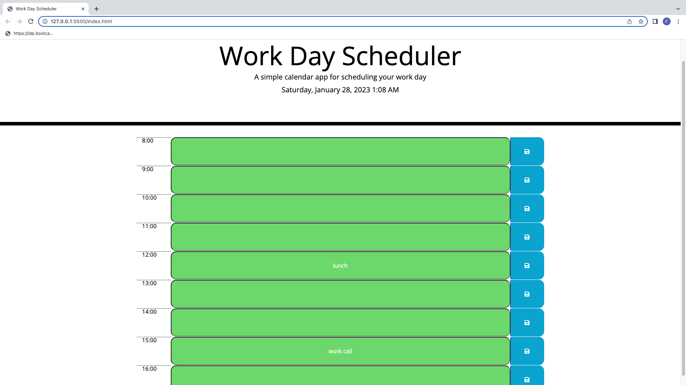

# daily-planner-app
This project is a Daily planner app for time management developed using JavaScript JQuery.
- It displays the current day at the top of the calendar when a user opens the planner.
- It shows a colour background for each time block based on past (grey), present(red), and future(green) when the time block is viewed.
- It allows a user to enter an event when they click a time block.
- It saves the event in local storage when the save button is clicked in that time block. 

## Deployed Link
https://ellaflo.github.io/daily-planner-app/

## Repository Link
https://github.com/ellaflo/daily-planner-app

## Installation
N/A

## Usage
Screenshot of project

## Credits
N/A

## License
Please refer to the LICENSE in the repo.
